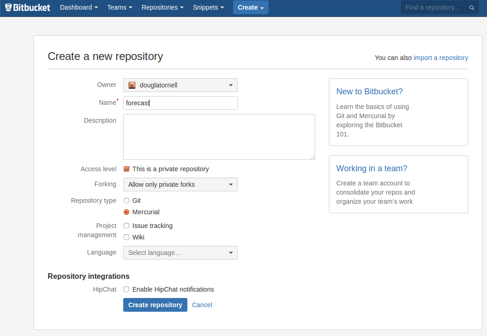
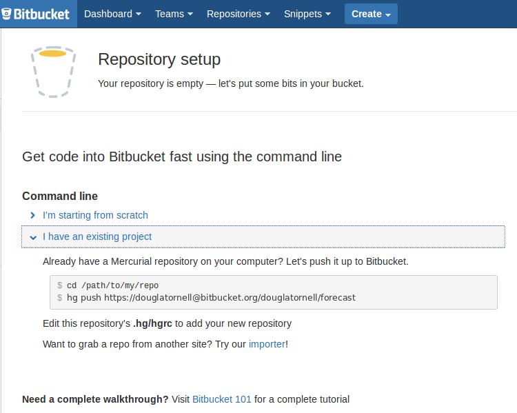
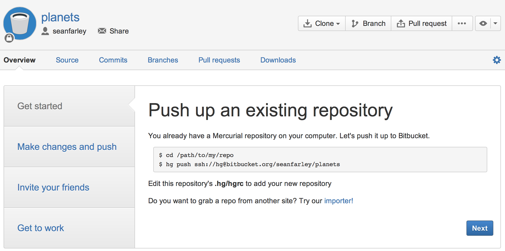

> ## Learning Objectives {.objectives}
>
> *   Explain what remote repositories are and why they are useful.
> *   Explain what happens when a remote repository is cloned.
> *   Explain what happens when changes are pushed to or pulled from a remote repository.

Version control really comes into its own
when we begin to collaborate with other people.
We already have most of the machinery we need to do this;
the only thing missing is to copy changes from one person's repository to another.

Systems like Mercurial allow us to move work between any two repositories.
In practice,
though,
it's easiest to use one copy as a central hub,
and to keep it on the web rather than on someone's laptop.
Most programmers use hosting services like [BitBucket](http://bitbucket.org)
and similar to hold those master copies;
we'll explore the pros and cons of this in the final section of this lesson.

Let's start by sharing the changes we've made to our current project with the world.
Log in to BitBucket,
then click on the icon in the top right corner to create a new repository called `planets`:

Name your repository "planets" and then click "Create Repository":

As soon as the repository is created,
BitBucket displays a page with a URL and some information on how to configure your local repository:

This effectively does the following on BitBucket's servers:

~~~ {.bash}
$ mkdir planets
$ cd planets
$ hg init
~~~

Our local repository still contains our earlier work on `mars.txt`,
but the remote repository on BitBucket doesn't contain any files yet:

The next step is to connect the two repositories.
We do this by making the BitBucket repository a **remote**
for the local repository.
The home page of the repository on BitBucket includes
the string we need to identify it after clicking on "I have an existing project to push up":

Change the 'ssh://' string to 'https://' in the url **protocol**.
It's slightly less convenient for day-to-day use,
but much less work for beginners to set up.

Copy that URL from the browser,
go into the local `planets` repository,
and use your text editor to add the following lines to `.hg/hgrc`:

~~~
[paths]
default = https://bitbucket.org/vlad/planets
~~~

Make sure to use the URL for your repository rather than Vlad's;
the only difference should be your username instead of `vlad`.

We can check that the command has worked by running `hg paths`:

~~~ {.bash}
$ hg paths
~~~
~~~ {.output}
default = https://bitbucket.org/vlad/planets
~~~

Once the default path is set up,
this command will push the changes from our local repository
to the repository on BitBucket:

~~~ {.bash}
$ hg push
~~~
~~~ {.output}
pushing to https://bitbucket.org/vlad/planets
searching for changes
adding changesets
adding manifests
adding file changes
added 1 changesets with 1 changes to 1 files
~~~

Our local and remote repositories are now in this state:

We can pull changes from the remote repository to the local one as well:

~~~ {.bash}
$ hg pull
~~~
~~~ {.output}
pulling from https://bitbucket.org/vlad/planets
searching for changes
no changes found
~~~

Pulling has no effect in this case
because the two repositories are already synchronized.
If someone else had pushed some changes to the repository on BitBucket,
though,
this command would download them to our local repository.

We can simulate working with a collaborator using another copy of the repository on our local machine.
To do this,
`cd` to the directory `/tmp`.
(Note the absolute path:
don't make `tmp` a subdirectory of the existing repository).
Instead of creating a new repository here with `hg init`,
we will **clone** the existing repository from BitBucket:

~~~ {.bash}
$ cd /tmp
$ hg clone https://bitbucket.org/vlad/planets
~~~

`hg clone` creates a fresh local copy of a remote repository.
(We did it in `/tmp` or some other directory so that we don't overwrite our existing `planets` directory.)
Our computer now has two copies of the repository:

Let's make a change in the copy in `/tmp/planets`:

~~~ {.bash}
$ cd /tmp/planets
$ nano pluto.txt
$ cat pluto.txt
~~~
~~~ {.output}
It is so a planet!
~~~
~~~ {.bash}
$ hg add pluto.txt
$ hg commit -m "Some notes about Pluto"
~~~

then push the change to BitBucket:

~~~ {.bash}
$ hg push
~~~
~~~ {.output}
pushing to https://bitbucket.org/vlad/planets
searching for changes
adding changesets
adding manifests
adding file changes
added 1 changesets with 1 changes to 1 files
~~~

Note that we didn't have to create a remote called `default`:
Mercurial does this automatically,
using that name,
when we clone a repository.
(This is why `default` was a sensible choice earlier
when we were setting up remotes by hand.)

Our three repositories now look like this:

We can now download changes into the original repository on our machine:

~~~ {.bash}
$ cd ~/planets
$ hg pull
~~~
~~~ {.output}
pulling from https://bitbucket.org/vlad/planets
searching for changes
adding changesets
adding manifests
adding file changes
added 1 changesets with 1 changes to 1 files
(run 'hg update' to get a working copy)
~~~

If we look at our repository history now with the `hg log --graph` command we can see that the `@` character marks the revision that our working copy of the files is at and the revision that we pulled from Bitbucket is above that,
meaning it has not yet been applied to our working files:

~~~ {.bash}
$ hg log --graph
~~~
~~~ {.output}
o  changeset:   3:2e9c23a9090d
|  user:        Vlad Dracula <vlad@tran.sylvan.ia>
|  date:        Mon Apr 14 16:56:42 2014 -0400
|  summary:     Some notes about Pluto
|
@  changeset:   2:43da31fb96ec
|  user:        Vlad Dracula <vlad@tran.sylvan.ia>
|  date:        Mon Apr 14 16:37:12 2014 -0400
|  summary:     Thoughts about the climate
|
o  changeset:   1:9b3b65e50b8c
|  user:        Vlad Dracula <vlad@tran.sylvan.ia>
|  date:        Mon Apr 14 15:52:43 2014 -0400
|  summary:     Concerns about Mars's moons on my furry friend
|
o  changeset:   0:72ab25fa99a1
   user:        Vlad Dracula <vlad@tran.sylvan.ia>
   date:        Mon Apr 14 14:41:58 2014 -0400
   summary:     Starting to think about Mars
~~~

To apply those changes we use `hg update`
(as Mercurial helpfully suggested at the end of the `hg pull` process):

~~~ {.bash}
$ hg update
~~~
~~~ {.output}
1 files updated, 0 files merged, 0 files removed, 0 files unresolved
~~~

You can use `hg log --graph` again to that the `@` has been moved to changeset 3 which tells us that our working copy is up to date.

Here is what our 2 local repositories and our Bitbucket repository look like now,
showing how the `pluto.txt` file has been copied from Bitbucket to our `planets/` repository clone:

In practice,
we would probably never have two copies of the same remote repository
on our laptop at once.
Instead,
one of those copies would be on our laptop,
and the other on a lab machine,
or on someone else's computer.
Pushing and pulling changes gives us a reliable way
to share work between different people and machines.

> ## FIXME {.challenge}
>
> Create a repository on BitBucket,
> clone it,
> add a file,
> push those changes to BitBucket,
> and then look at the **timestamp** of the change on BitBucket.
> How does BitBucket record times, and why?
